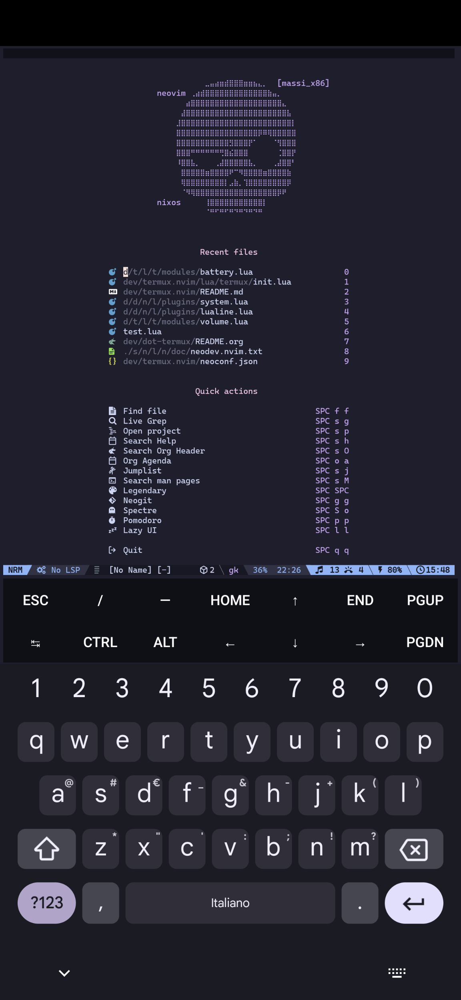
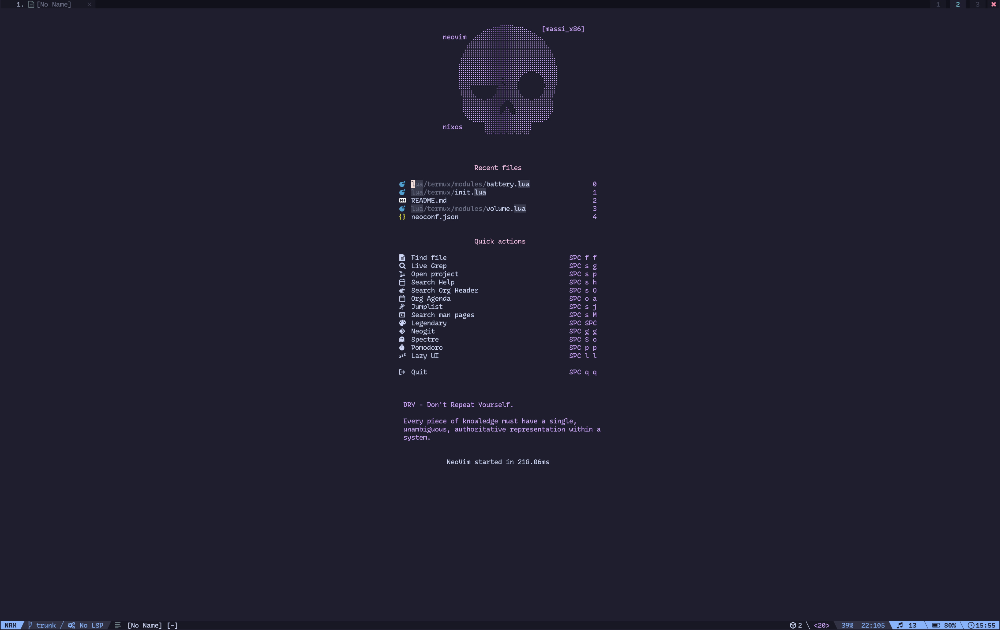

[](https://awesome.re)

# Termux.nvim
This plugin gathers information from the [Termux API](https://github.com/termux/termux-api) and make them available as
`lua tables` for users. It also provides some helper functions to use in different
statuslines (tested only with [Lualine](https://github.com/nvim-lualine/lualine.nvim) for now, but it should be compatible with
every statusline).

Here you have some nice screenshots!

### Music and call volumes, battery discharging


### Music and call volumes, battery charging wirelessly


### Music and call volumes, battery charging via cable


### Connected via SSH from the desktop


## Usage
Before using the plugin there are a couple of things you have to do manually on
your Android phone:
  1. Install Termux from the [F-Droid platform](https://f-droid.org/);
  2. Install the [Termux:API](https://f-droid.org/en/packages/com.termux.api/) package;
  3. Open the Termux app from the System Settings and grant it all the authorizations;
  4. Run the `termux-battery-status` and `termux-volume` at least once the first time
    you install the `Termux:API` package, this is necessary to register the authorizations;
  5. Install Neovim and configure a package manager.

> [!WARNING]
> This plugin has only been tested with Termux coming from the F-Droid platform.
> I know that there are some limitations in the Termux version which is available
> from the Play Store, but I honestly do not know which ones.

Now you can install the plugin, for example using [Lazy](https://github.com/folke/lazy.nvim):
```lua
return {
  {
    "massix/termux.nvim",
    dependencies = {
      { "nvim-lua/plenary.nvim" },
    },
    opts = {},
    event = "VimEnter",
  },
}
```

The default configuration for the plugin is the following, you can of course
override a field by passing a partial table to the `setup()` function.

```lua
{
  battery = {
    enabled = true,
    refresh_rate = 30, -- refresh rate in seconds
    -- The following settings are used to configure the statusline string,
    -- you can ignore them if you are building your own string.
    print_percentage = true,
    icons = {
      empty = "  ",
      oneq = "  ",
      half = "  ",
      threeq = "  ",
      full = "  ",
      charging = "󰉁 ",
      wireless = "󰠕  ",
    },
  },
  volume = {
    enabled = true,
    refresh_rate = 10, -- refresh rate in seconds
    -- The following settings are used to configure the statusline string,
    -- you can ignore them if you are building your own string.
    streams = { "music", "ring", "notification", "system", "call" },
    icons = {
      call = "󱡏  ",
      system = "  ",
      ring = "󱆫  ",
      music = "  ",
      alarm = "󰀠  ",
      notification = "  ",
    },
  },
}
```

If you are not interested in getting the volume levels, simply call the `setup()`
function like follows:
```lua
require("termux").setup({ volume = { enabled = false }})
```

The default configuration will gather information about the battery status and
the different volume levels and make them available in the `_G.termux_values`
table. You can then use that table however you want. The content of the table
is:

```lua
_G.termux_values = {
  battery = {
    percentage = 0,
    status = "DISCHARGING",
    health = "GOOD",
    plugged = false,
    temperature = 25.5,
    wireless = false,
  },
  volumes = {
    call = {
      stream = "call",
      volume = 0,
      max_volume = 7,
    },
    system = {
      stream = "system",
      volume = 0,
      max_volume = 7,
    },
    ring = {
      stream = "ring",
      volume = 0,
      max_volume = 7,
    },
    music = {
      stream = "music",
      volume = 0,
      max_volume = 25,
    },
    alarm = {
      stream = "alarm",
      volume = 0,
      max_volume = 7,
    },
    notification = {
      stream = "notification",
      volume = 0,
      max_volume = 7,
    },
  },
```

You can then use this table in your statusline. There are some default
functions provided by the plugin, you can simply include them in your
Lualine configuration easily:
```lua
  {
    "nvim-lualine/lualine.nvim",
    event = "VeryLazy",
    opts = {
      sections = {
        lualine_x = {
          -- Volume information
          {
            function()
              return require("termux").get_volume_statusline()
            end,
          },
          -- Battery information
          {
            function()
              return require("termux").get_battery_statusline()
            end,
          },
        },
      },
    },
  },
````

## Commands
The plugin also exposes some commands to interact with the [wake lock](https://wiki.termux.com/wiki/Termux-wake-lock#:~:text=termux-wake-lock%20and%20termux,wake-unlock%20in%20your%20~%2F%2e) command
of Termux, used to make sure that the terminal will stay awake and won't be
set to sleep by the application.

* `:TermuxWakeLock <hold|release>` to either hold or release the WakeLock;
* `:TermuxHoldWakeLock` alias for `:TermuxWakeLock hold`;
* `:TermuxReleaseWakeLock` alias for `:TermuxWakeLock release`;

## APIs
The plugin exposes some APIs that you may want to use in your configuration.
In the following table, I assume that

```lua
local termux = require("termux")
```

| API                             | Function                                                                     |
|-------------------------------- | ---------------------------------------------------------------------------- |
| `termux.stop_all_timers()`        | Stops all background tasks                                                   |
| `termux.start_all_timers()`       | Starts all background tasks                                                  |
| `termux.get_volume_info()`        | Trigger a background task to retrieve the volume information                 |
| `termux.get_battery_info()`       | Trigger a background task to retrieve the battery information                |
| `termux.get_battery_statusline()` | Builds a string with the battery information to be displayed in a statusline |
| `termux.get_volume_statusline()`  | Builds a string with the volume information to be displayed in a statusline  |
| `termux.release_wake_lock()`      | Release the wake lock                                                        |
| `termux.hold_wake_lock()`         | Hold the wake lock                                                           |

Both the `get_volume_info()` and the `get_battery_info()` will populate the
`_G.termux_values` table for future use.


## Contributions
Contributions are welcome, especially if you have an idea on how to test this
plugin, I thought of using [Plenary](https://github.com/nvim-lua/plenary.nvim) and the [Termux Docker Image](https://github.com/termux/termux-docker) but for
obvious reasons this can't work (Termux APIs are unavailable in the docker
image).

There are a lot of things exposed by the Termux API, for now I was only interested
in retrieving the battery and volume information, but feel free to create a pull
request or open an issue if you are interesting in getting more information out of
it.

